<h1 align="center">
  <br>
 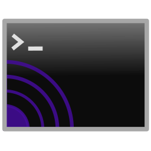
  <br>
Easy MQTT Handler 2
  <br>
</h1>
<h4 align="center">
Easy MQTT Handler 2 is a desktop [MQTT](https://mqtt.org/) Client.<br/>
Implemented in Python 3, it connects to an [MQTT broker](https://www.home-assistant.io/integrations/mqtt/), listens for freely configurable messages, and reacts by executing arbitrary predefined commands.<br/>
It comes with a Qt5-based GUI.<br/>
License: GPLv3+.<br/>
<br/>
</h4>

This repository is a fork and continuation of the awesome [Easy MQTT Handler](https://github.com/andzeil/easy-mqtt-handler) developed by [A. Zeil](https://github.com/andzeil).

# Table of contents

- [Purpose of this tool](#purpose-of-this-tool)
- [Using this tool](#using-this-tool)
  - [Connection tab](#connection-tab)
  - [Payload Handlers tab](#payload-handlers-tab)
  - [Send on Startup tab](#send-on-startup-tab)
  - [Logs tab](#logs-tab)
  - [The Tooblar](#the-toolbar)
- [Configuration files](#configuration-files)
  - [Linux / MacOS](#linux--macos)
  - [Windows](#windows)
  - [Portable mode](#portable-mode)
- [Command line arguments](#command-line-arguments)
- [Integrating with Home Assistant](#integrating-with-home-assistant)
  - [Creating your first automation wit Easy MQTT Handler](#creating-your-first-automation-wit-easy-mqtt-handler)
- [Roadmap](#roadmap)
- [Support](#support) 

# Purpose of this tool

Easy MQTT Handler was mainly developed to provide an easy way to integrate Personal Computers into Home Automation. The tool
offers a simple, but functional, GUI to connect to an MQTT Broker and listen to a topic. 

The user is able to define commands and parameters that should be part of the payload of the MQTT messages received from
the broker. For each command/parameter combination the user can then define an executable that should be launched 
once a certain command/parameter combination is received.

The tool is neatly integrating into the users' environment by sitting in the tray area as a tray icon. 

# Using this tool

The first time you start Easy MQTT Handler 2 you will see the main application window. It's featuring a tabbed interface
with 3 tabs, a toolbar and a statusbar.

## Connection tab

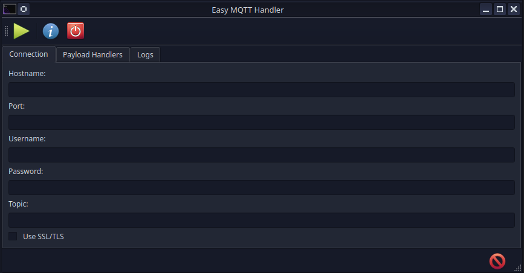

In the Connection Tab the user can provide the Hostname, Port, Username, Password and Topic to connect to the [MQTT Broker](https://www.home-assistant.io/integrations/mqtt/).
Furthermore, you can configure Easy MQTT Handler 2 to make use of SSL/TLS, by ticking the checkbox **Use SSL/TLS**. Although,
SSL/TLS makes the setup a little bit more complicated it might still be worth it for you. You can configure the tool
just use SSL/TLS for encryption in transit, or even for client certificate authentication. If you want to set this up
please take a look at the [SSL/TLS Configuration](./docs/SSL.md) documentation. It will walk you through using
certificates provided by a Certificate Authority (CA) and self-signed certificates by using openSSL to create all the 
necessary certificates and your own CA.

## Payload Handlers tab

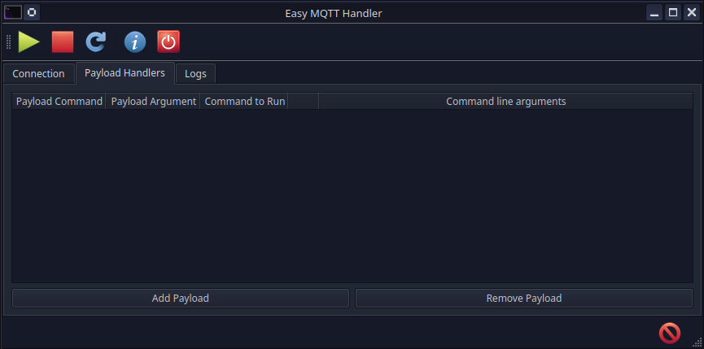

This tab is where the magic happens! To start click the **Add Payload** Button, which will create a new empty line in 
the table above the buttons. Now all you need to do is click on the cells of the tables to define the **Payload Command**
and **Payload Argument** to listen for. Next, set up whatever executable should be launched in the **Command to Run**
column. Should you need to add some command line parameters to the executable you can do so via the 
**Command line arguments** column. Look into the chapter [Integrating with Home Assistant](#integrating-with-home-assistant)
for some example.

Since **Version 0.1.2** there's a new feature for Power Users: parameters. With parameters, you can easily pass dynamic
command line arguments to the command you want to run. The process is quite straight-forward:

Set up the MQTT Payload like this: `{"command":"notify","args":"test", "param1":"test1", "param2":"test2"}`.

You can then use `$X` in the **Command line arguments** column. `$X` would be replaced by
the content of `paramX` within the payload. In our example if you put `$1 $2` into the **Command line arguments** column it
will be replaced with `test1 test2` once the above MQTT payload is received.

Should you have, e.g. `$3` defined in the **Command line arguments**, but the MQTT payload does not contain `param3`, `
$3` will be removed from the command line arguments automatically, in order to not be passed to the command you want to run.

## Send on Startup tab

While the [Payload Handlers tab](#payload-handlers-tab) defines what happens when a message *arrives*, this tab
defines messages the tool *sends* by itself. Everything listed here is published as soon as a connection to the
broker has been established, just before the tool starts listening.

Leave the tab empty and nothing is sent, which is exactly how the tool behaved before this feature existed.

The typical use is letting each of your machines announce or configure its own entities in Home Assistant
whenever it comes online, so a desktop and a laptop can each set up what belongs to them, or a multi-boot machine can announce which operating system is currently running.

Every row is one message:

| Column | Meaning |
|---|---|
| **Topic** | The MQTT topic to publish to. This is an **absolute** topic and is *not* prefixed with the topic from the Connection tab, because you are usually addressing some other device's entity. |
| **Payload** | What to send. Plain text or JSON, whatever the receiving side expects. |
| **QoS** | Quality of Service, `0`, `1` or `2`. Leave it at `0` if you have no reason to change it. |
| **Retain** | Ask the broker to remember this message and deliver it to anyone subscribing later. Home Assistant usually wants this on for configuration messages. |
| **HA Entity** | Which kind of Home Assistant entity to create. Defaults to `sensor`. Optional, see below. |
| **HA ID** | The unique id of the entity to create. Filling this in is what switches auto discovery on. Optional. |
| **HA Name** | The friendly name shown in Home Assistant. Optional, defaults to the HA ID. |

Use **Add Message** and **Remove Message** to manage the list, then save with the toolbar's save button, just as
on the Payload Handlers tab. Rows without a topic are ignored, so a half-finished row is never sent.

### Creating Home Assistant entities automatically

Normally, getting a value from this tool into Home Assistant means editing YAML and restarting it. MQTT auto
discovery avoids that: if you publish a small JSON description of an entity to a special topic, Home Assistant
creates the entity immediately.

This tool can do that for you. **Fill in HA ID on a row** and, just before sending that row's message, it also
publishes a discovery message:

	topic:   homeassistant/<HA Entity>/<HA ID>/config
	payload: {"name": "<HA Name>", "state_topic": "<Topic>", "unique_id": "<HA ID>"}

So, for example, a row with Topic `workstation/dev-box/operating-system`, HA Entity `sensor`, HA ID `dev_box_operating_system` and
HA Name `Dev Box Operating System` gives you the entity `sensor.dev_box_operating_system` in Home Assistant, already
pointed at the right topic. This is exactly what makes the "different desktops configure their own entities"
idea work: each machine announces what belongs to it as it comes online.

**Leave HA ID empty and nothing changes** — the row is published just like before. That is also true of every
configuration made before this feature existed.

A few details worth knowing:

* The discovery message is **always** sent retained, whatever the row's own Retain setting says. Home Assistant
  forgets entities whose discovery message was not retained, so this is not optional.
* Tick **Retain** on the row itself as well if you want the value to survive. Home Assistant subscribes to the
  state topic a moment after it processes the discovery message, so an unretained value sent immediately
  afterwards can be missed.
* **HA Entity** and **HA ID** both become part of a topic, so they may only contain letters, digits, underscores
  and hyphens. A row that breaks this rule is reported in the [Logs tab](#logs-tab) and skipped for discovery
  only — its own message is still sent.
* **Removing a row does not remove the entity** from Home Assistant, because the retained discovery message is
  still sitting on the broker. To delete one, add a row that publishes an *empty* Payload with **Retain** ticked
  to that same `homeassistant/<HA Entity>/<HA ID>/config` topic, leave HA ID blank on it, and start the tool
  once. Then delete that row too.

These messages are stored separately from everything else, in `default-startup-messages.json`, next to the other
configuration files.

One thing worth knowing: the messages are sent on **every** successful connection, not only the first one after
launching. If the connection drops and is re-established, or you press Reconnect, they are sent again. That is
usually what you want, because a broker restart loses any retained state, but it does mean you should avoid
putting anything in here that toggles rather than sets a value. Every message sent is recorded in the
[Logs tab](#logs-tab).

## Logs tab

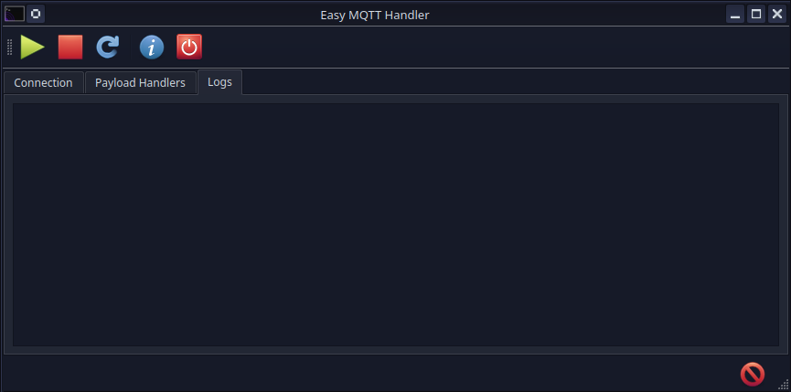

The last tab of the tool is the Logs tab: It should help the user to pinpoint any sort of potential problem that may 
arise with the connection to the broker and the tool's configuration.

## The Toolbar

These buttons are always visible:

|  | **Shows the licenses** |
|------------------------------------------------------------|------------------------|
|    | **Closes the tool**    |

These buttons are only visible if there's a connection established to a broker:

|  | **Disconnects from the broker** |
|----------------------------------------------------------------------|---------------------------------|
|    | **Reconnects to the broker**    |

This Button is only visible when there's no connection to a broker:

|  | **Connects to the broker** |
|----------------------------------------------------------------|----------------------------|

This button is only visible when the user did changes to the configuration:

|  | **Save the last changed settings** |
|---------------------------------------------------------------|------------------------------------|

Easy MQTT Handler will bug you automatically when you want to close the application without saving your changes. \
Just to make sure you never lose anything you've reconfigured.

# Configuration files

## Linux / MacOS

You should be able to locate the standard configuration files in your home directory. 
Here's the path you should be able to copy & paste: `~/.config/easy-mqtt-handler/` \
Inside you will find up to three files: `default-settings.json`, `default-payloads.json` and
`default-startup-messages.json`.

`default-settings.json` contains the connection configuration parameters. \
`default-payloads.json` contains all the payloads you defined. \
`default-startup-messages.json` contains the messages from the [Send on Startup tab](#send-on-startup-tab).
It is only written once you have added something there.

It's possible to use other configuration files, in fact you can have as many as you want to. The trick is to
use [Command line arguments](#command-line-arguments) to launch Easy MQTT Handler.
You can also launch as many instances in parallel as you want, by starting them with different command line arguments.

## Windows

On Windows the configuration files are exactly the same. However, you will find them in `%appdata%\\easy-mqtt-handler\`. \
Press `[Win]`-key + `[R]` and type in `%appdata%\\easy-mqtt-handler\`, then click `[Ok]` and you should see the
configuration files.

## Portable mode

Easy MQTT Handler can keep its configuration next to itself instead of in your home directory, which is
handy for running it from a USB stick or a synced folder.

### The ready-made portable download

The simplest route is the portable release for your system. It already has everything set up.

**Windows** — `Easy MQTT Handler 2-<version>-windows-Portable.zip`

1. Unzip it wherever you like, including a USB stick.
2. Open the folder it creates and run `Easy MQTT Handler 2.exe`.

**Linux** — `Easy MQTT Handler 2-<version>-linux-Portable.tar.gz`

1. Unpack it wherever you like: `tar xzf "Easy MQTT Handler 2-<version>-linux-Portable.tar.gz"`
2. Open the folder it creates and run `Easy MQTT Handler 2` inside it.

That's it. The `data` folder is already inside, so the program is self-contained from the first start
and writes nothing outside its own folder. No installation and no administrator rights are needed.

The two archives hold the same thing: the whole program in one folder, with a `data` folder beside it.
On Linux the item you start is a small launcher script rather than the program itself, because the
program lives in `usr/` inside the folder and the launcher is what tells it to use `data`.

> The **AppImage** download is a different thing and does *not* use the `data` folder. AppImages have
> their own way of keeping configuration alongside themselves, using folders named
> `<name>.AppImage.home` or `<name>.AppImage.config`. Use the portable `.tar.gz` if you want the
> behaviour described here.

### Turning any copy into a portable one

To switch it on manually, create a folder named `data` **next to the program's executable**:

```
Easy MQTT Handler 2.exe
data\
```

That's all there is to it. On the next start the program notices the folder and reads and writes
`default-settings.json`, `default-payloads.json`, `default-startup-messages.json` and its temporary
certificate file there. Nothing is
stored in your home directory, and the program behaves the same no matter which directory you launch
it from.

Remove the `data` folder and the program goes back to the standard per-user location described above.
Your configuration stays in the `data` folder, so you can switch back and forth by moving the files.

A few details worth knowing:

* The `data` folder is never created for you. Its presence is what turns the feature on, so creating it
  automatically would quietly opt you in for good.
* Only a real folder counts. A file that merely happens to be named `data` is ignored.
* [Command line arguments](#command-line-arguments) still win. If you pass `--mqtt-configuration-file`
  or `--payload-configuration-file`, those files are used regardless of portable mode.
* Make sure the program can write to the folder. If you installed into `C:\Program Files\`, Windows will
  not normally let it write there; unpack the program somewhere else for portable use.

# Command line arguments

```
usage: __main__.py [-h] [-mqtt-conf MQTT_CONFIGURATION_FILE]
                   [-payload-conf PAYLOAD_CONFIGURATION_FILE]
                   [-startup-conf STARTUP_CONFIGURATION_FILE]

Easy MQTT Handler

options:
  -h, --help            show this help message and exit
  -mqtt-conf MQTT_CONFIGURATION_FILE, --mqtt-configuration-file MQTT_CONFIGURATION_FILE
  -payload-conf PAYLOAD_CONFIGURATION_FILE, --payload-configuration-file PAYLOAD_CONFIGURATION_FILE
  -startup-conf STARTUP_CONFIGURATION_FILE, --startup-configuration-file STARTUP_CONFIGURATION_FILE
```

# Integrating with Home Assistant

To integrate Easy MQTT Handler with Home Assistant first install the **mosquitto** addon. \
Login to your Home Assistant web interface, then click on **Settings** and select **Add-Ons**:

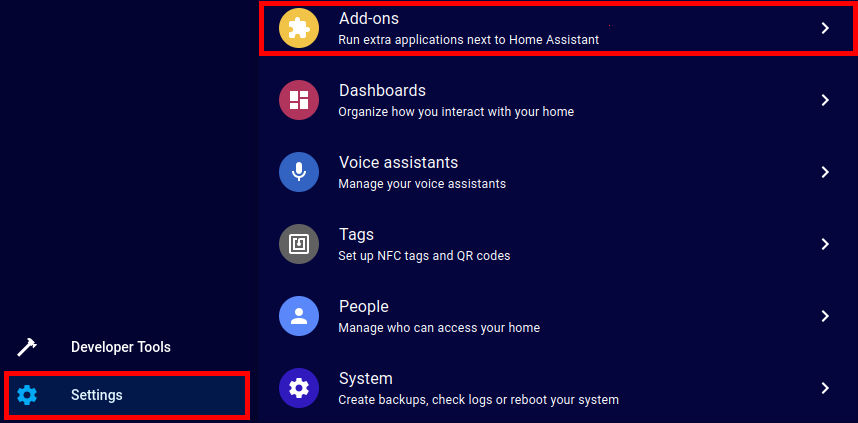

Afterwards, click the **Add-On Store** button:


In the Add-on Store click on the search box and type **mosquitto**. Then click the **Install** Button. Once installed
you can open the **Configuration** tab to configure mosquitto. \
You should then create a new user for Easy MQTT Handler to access mosquitto. To do so, click on **Settings** and next
select **People**:

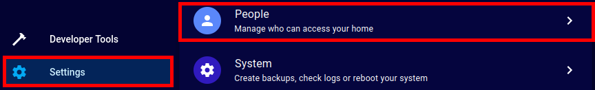

Hit the **Add Person** button:


In the next dialog you only need to set **Display name**, **Username** and **Password**+**Confirm Password**. 
You will need the username and password for Easy MQTT Handler to connect to the mosquitto broker.

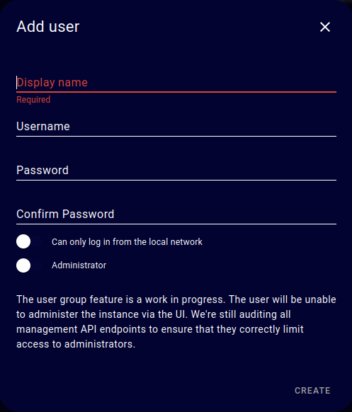

To use the Mosquitto as a broker in Home Assistant you need to go to the integration page and install the configuration 
with one click: Goto Settings -> Devices & Services -> Integrations. MQTT should now appear as a discovered integration 
at the top of the page. Select it and check the box to enable MQTT discovery if desired, then hit the submit button.

In theory this is all you need to connect Easy MQTT Handler with Home Assistant.

There's now two things you could do:

1. (optional) Enhance the security of your mosquitto broker by proceeding to [SSL/TLS Configuration](./docs/SSL.md)
2. Add an MQTT call to an automation to test the integration

### Creating your first automation wit Easy MQTT Handler

To create your first automation configure Easy MQTT Handler, first. As described in [Connection Tab](#connection-tab)
set up the connection to the mosquitto broker. Port **1883** should be used for MQTT, **8883** in case you've set up
SSL/TLS. There's no support for MQTT over Websocket at the moment. This example uses the topic **easy_mqtt_handler_pc1**.
As you can choose your topic freely, ymmv!

Next, move on to the [Payload Handlers Tab](#payload-handlers-tab). If you are on Linux here's a Payload Handler you 
could set up for testing (uses the tool notify-send, on Ubuntu it's inside the package `libnotify-bin`):

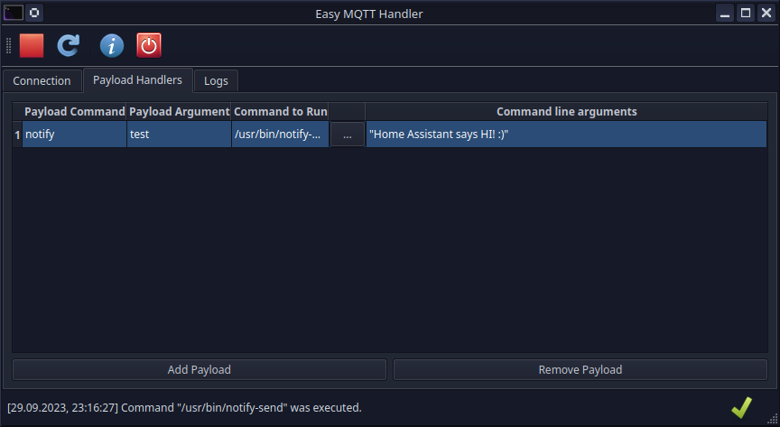

Now, head over to your Home Assistant's web interface and go to the **Settings** > **Automations & Scenes** page:

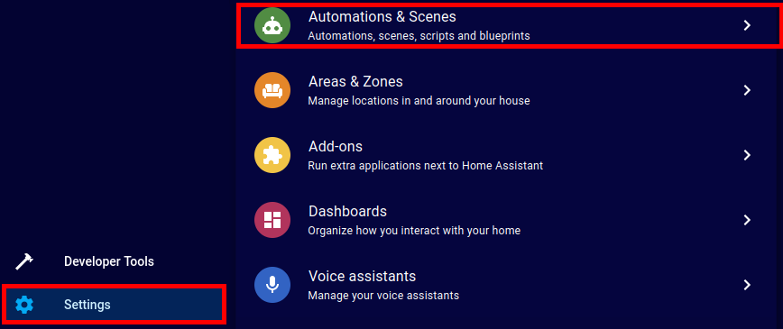

Here click the **Create Automation** button:


In the next dialog select **Create new automation**:

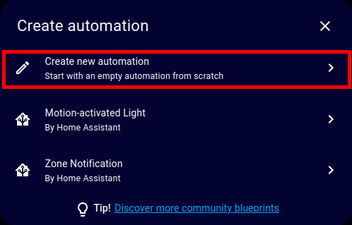

Finally, create an automation like this, for testing:

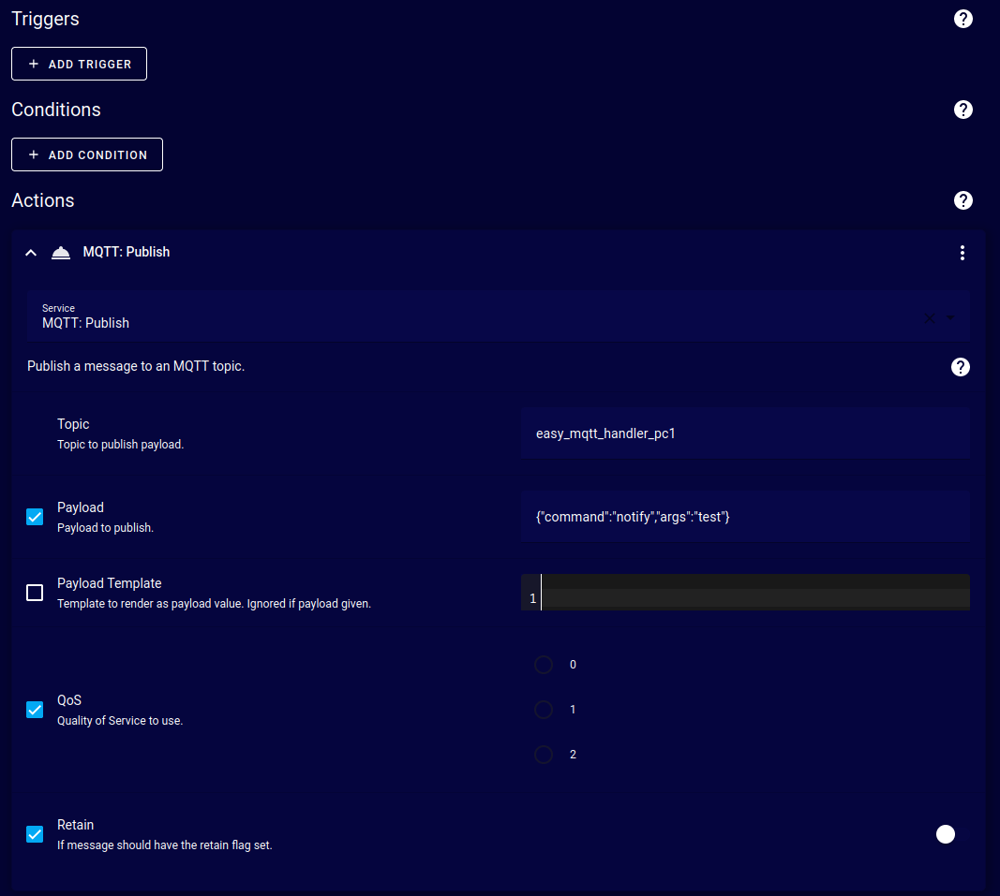

We don't really care for the Triggers and Conditions right now, all we want to do is select **MQTT: Publish** as the
Action. You can find it by clicking on **Add Action** and selecting **Call Service**. \
Now choose a topic. For the purpose of this tutorial we are using **easy_mqtt_handler_pc1** (remember: we configured this
in Easy MQTT Handler earlier, already!) \
The last step is to check the **Payload** checkbox and insert the following payload for our test:
`{"command":"notify","args":"test"}`.

That's it! You can now click on the "3 dots" menu right to **MQTT: Publish** and send the payload to the mosquitto broker
by clicking on **Run**.

If everything goes as expected you should now see the following Balloon notification on your desktop:

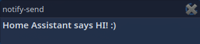

If for some reason it didn't work, make sure to check the [Logs tab](#logs-tab). If the logs show that the payload was 
received and successfully parsed but nothing happens: just try something other than `notify-send`. 
Sky's the limit here. Make this tool yours!

|  | Developers and tinkerers please check [CONTRIBUTING.md](./docs/CONTRIBUTING.md) for specific information about developing, building, translating and contributing. |
